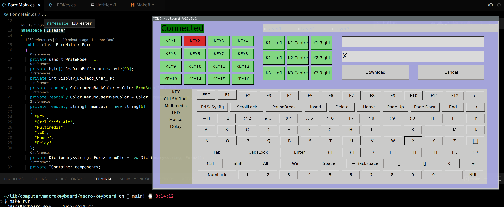

# mini-keyboard-configurator
This is a basic port of the original Windows
Configurator application for Linux, for this macro keyboard:




You can purchase the keyboard [here](https://www.aliexpress.com/item/1005005066128972.html).

## Requirements:
* mono installed (including WinForms)
* python3 and pyusb installed

Due to the lack of libusb support in Mono,
I have used a python script to send the configuration
output to the device.

## Build and run:
```
$ make run
```

## Limitations
* device presence/connection detection does not work, it always shows 'Connected'
* device type detection does not work; it may work for the other keyboard types as the
  one displayed above, but don't take my word for it
* some characters on the Buttons are not rendered correctly

## Status / Outlook
It is basically functioning that I can download configuration
to the macro keyboard and it works for my purposes.
Nevertheless the code still would still need a lot of work for
a production ready application, but my priorities won't allow for this.
I hope it will be useful to someone, who might put more work into it.

Contributions welcome!
